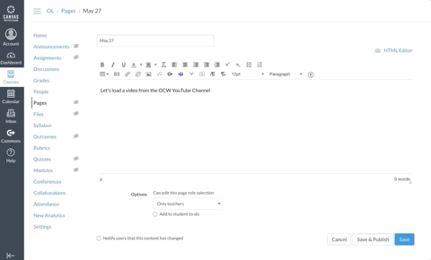

# ocw-youtube-lti
Search and embed OCW YouTube videos from the (https://community.canvaslms.com/docs/DOC-10728-what-is-the-rich-content-editor)[Canvas RCE] (Rich Content Editor). (https://www.imsglobal.org/activity/learning-tools-interoperability)Canvas App integrations via [LTI] (Learning Technology Interoperability) allow tools for creating/integrating content to be directly added to a course authors workflow (RCE). 

We are motivated by the possibilities of integrating existing MIT content into Canvas (coming to MIT Fall 2020). Two codebases were utlized together in order to show this proof of concept. 
* YouTube Flask App: [Create a YouTube Search App in Flask Using the YouTube Data API](https://github.com/PrettyPrinted/youtube_video_code/tree/master/2019/07/28/Create%20a%20YouTube%20Search%20App%20in%20Flask%20Using%20the%20YouTube%20Data%20API)
* PyLTI is an MIT maintained package that streamlines LTI implementations; it drastically simplified this prototype.

## Things you will need
This app should be deployable on Heroku with minimal changes. 
* (https://devcenter.heroku.com/articles/git)[Deploy with Heroku].
* (https://developers.google.com/youtube/v3/getting-started)[YouTube > Data API] key is needed to query YouTube (covered in the Pretty Printed walkthrough below). 

## Purpose of this app
We hope to motivate possibilities for existing content across MIT to find ways into authoring flows inside Canvas (coming to MIT Fall 2020). This app provides a roadmap for an integration with the RCE. LTI tools can also be embedded without the RCE and this app can be adapted to for those needs (e.g., directly linking a tool in the Modules section of a Canvas course). 

## Possibly coming soon...
If needed, we will round out some of the documentation related to installing in Canvas and other configurations.

## Demo

